# 군 경계지역 CCTV 영상 품질 개선을 통한 지능형 분석 고도화

## 📜 프로젝트 개요
군 경계 지역 CCTV 영상의 화질 열화 문제를 개선하고 객체 탐지 및 보고서 생성 파이프라인을 구축하여 **군 경계 감시 업무의 자동화**를 지향하는 프로젝트입니다.

군 감시 카메라 영상에 실시간 열화 개선을 적용하여 객체 탐지 안정성을 높이며, 탐지 내용 기반의 보고서를 작성하고 구조화된 탐지 결과를 제공하는 통합된 시스템을 제시합니다.

## 🎬 데모

[[시연 영상은 이곳에서 확인하실 수 있습니다.]](https://www.youtube.com/watch?v=n9__Jga_j58)

## ✨ 주요 기능

- **🚨 객체 식별 알림**
  - 실시간 화질 개선이 적용된 감시영상에서 객체가 식별되면 사용자에게 알립니다.
  
- **📜 식별 개체에 대한 AI 보고서**
  - `HyperCLOVA X` 모델로부터 추론한, 탐지상황에 대한 세부 보고서를 제공합니다.
  
- **🗓️ 감시 기록 열람**
  - 탐지 기기, 일자 및 , 보고서를 비롯한 과거 탐지 기록을 열람합니다.
  

## 🏛️ 시스템 아키텍처
- **전체 구조**  

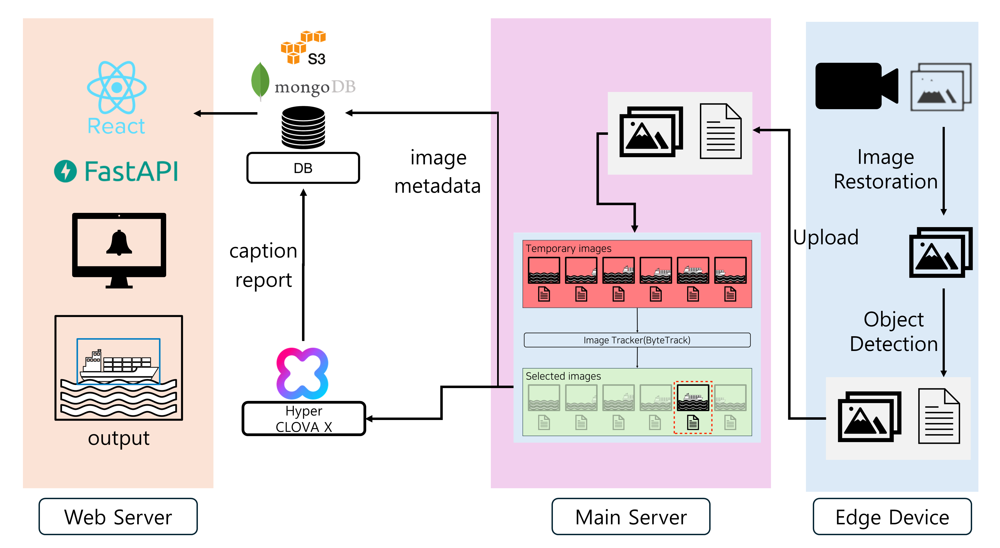
  

- **메인 서버**  

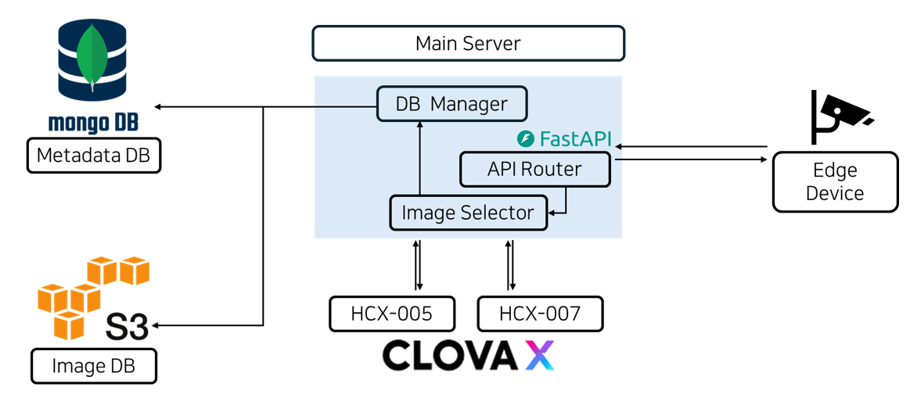
  

- **엣지 디바이스**  

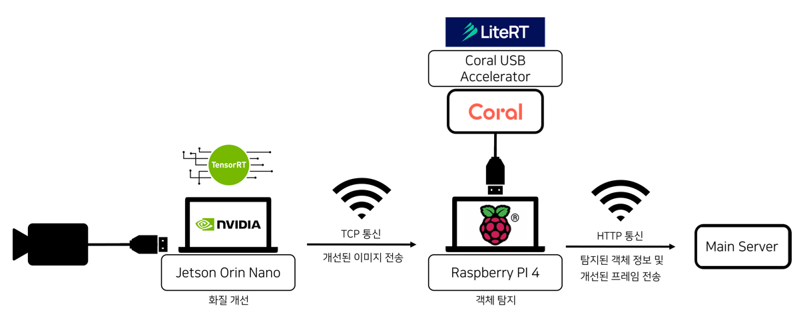
  

- **웹 서버**  

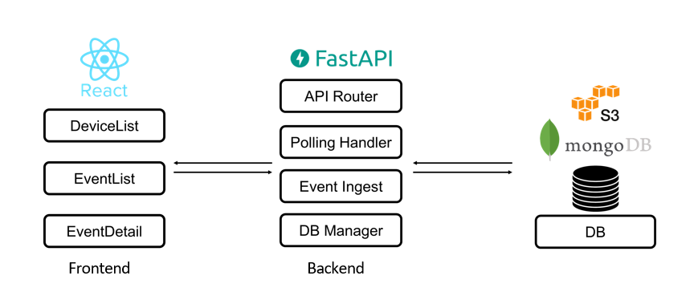
  

## 🔍 활용 모델 및 데이터베이스 구조

### 이미지 복원 모델

- **BioIR**  

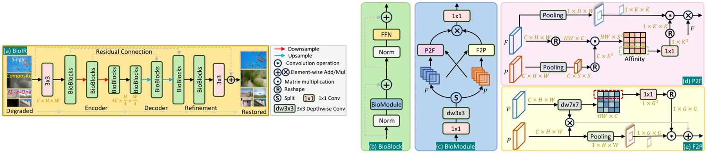
  
  인간 시각에서의 중심 시야와 주변 시야의 상호작용을 모사한 복합 열화 이미지 복원 모델입니다. 후술할 OneRestore와 같이 U-Net 구조를 가져 지식 증류에 유리하고 최신 이미지 복원 모델 중 높은 성능 지표를 보여 Teacher 모델로 선정했습니다.
  

- **OneRestore**  

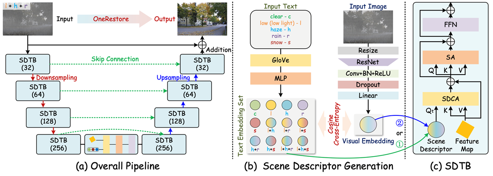

  복합 열화 환경에서 안정적인 복원 성능을 가지고 있으면서도, 약 598만개의 파라미터로 구성된 경량 모델로 Edge Device에서의 On-Device 추론에 적합하여 Student 모델로 선정했습니다.
  

- **Feature 기반 지식 증류**  

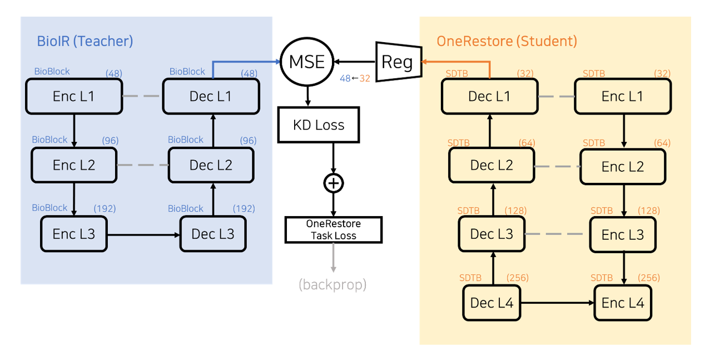

  높은 이미지 복원 성능의 Teacher 모델의 지식을 Student 모델로 이식하여 On-Device 추론에 활용하기 위해, feature 기반 지식 증류를 적용했습니다. 각 모델의 최종 디코더 출력 feature를 바탕으로 계산된 distillation loss를 사용합니다.
  

### 객체 탐지 모델

- **YOLOv8n**  

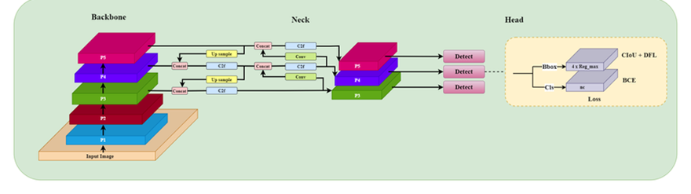

Single-stage 객체 탐지 모델로서, 특히 nano 모델의 경우 실시간성을 유지하면서 작은 객체도 잘 식별하기 때문에 정확도 측면에서도 뛰어날 것이라 판단하여 선정했습니다.
  

- **SSD MobileNet V2**  

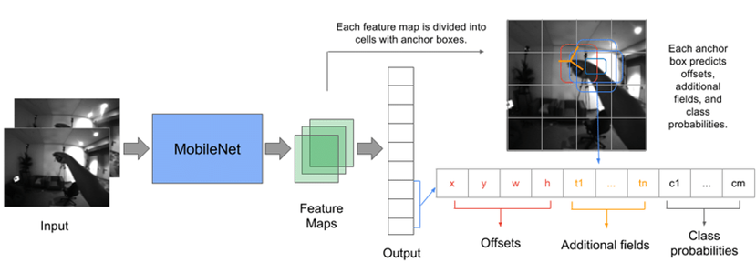

Google Coral에서 공식적으로 지원하는 객체 탐지 모델입니다. 초경량 및 저전력의 엣지 디바이스에 최적화되어 있으며 실시간성 측면에서 강점을 가져 선정했습니다.
  

### DB 스키마

- 객체 탐지 결과

<table width="100%" align="center">
  <thead>
    <tr>
      <th width="20%" align="center">Name</th>
      <th width="15%" align="center">Type</th>
      <th align="center">Description</th>
    </tr>
  </thead>
  <tbody>
    <tr>
      <td align="center"><b>created_at</b></td>
      <td align="center">datetime</td>
      <td>이미지가 생성된 시각</td>
    </tr>
    <tr>
      <td align="center"><b>remote_file_path</b></td>
      <td align="center">string</td>
      <td>해당하는 이미지의 AWS S3 저장 경로</td>
    </tr>
    <tr>
      <td align="center"><b>location_name</b></td>
      <td align="center">string</td>
      <td>이미지가 촬영된 위치</td>
    </tr>
    <tr>
      <td align="center"><b>client_id</b></td>
      <td align="center">string</td>
      <td>이미지를 보낸 Client의 ID</td>
    </tr>
    <tr>
      <td align="center"><b>metadata</b></td>
      <td align="center">json</td>
      <td>Edge Device의 Object Detection 결과</td>
    </tr>
    <tr>
      <td align="center"><b>caption</b></td>
      <td align="center">string</td>
      <td>HCX-005가 분석한 이미지 정보</td>
    </tr>
    <tr>
      <td align="center"><b>report</b></td>
      <td align="center">json</td>
      <td>HCX-007가 구조화한 캡션 정보</td>
    </tr>
  </tbody>
</table>

- 엣지 디바이스 상태

<table width="100%" align="center">
  <thead>
    <tr>
      <th width="20%" align="center">Name</th>
      <th width="15%" align="center">Type</th>
      <th align="center">Description</th>
    </tr>
  </thead>
  <tbody>
    <tr>
      <td align="center"><b>client_id</b></td>
      <td align="center">string</td>
      <td>Edge Device의 ID</td>
    </tr>
    <tr>
      <td align="center"><b>status</b></td>
      <td align="center">Bool</td>
      <td>Edge Device 연결 여부</td>
    </tr>
    <tr>
      <td align="center"><b>updated_at</b></td>
      <td align="center">datetime</td>
      <td>마지막으로 Heartbeat를 보낸 시간</td>
    </tr>
  </tbody>
</table>

### 활용 데이터셋 명세

<table width="100%" align="center">
  <thead>
    <tr>
      <th align="center">Usage</th>
      <th align="center">Dataset</th>
      <th align="center">Source</th>
      <th align="center">Type</th>
      <th align="center"># Samples</th>
      <th align="center">Description</th>
    </tr>
  </thead>
  <tbody>
    <tr>
      <td align="center"><b>Image Restoration</b></td>
      <td>외부 환경 노이즈 제거 영상 데이터</td>
      <td align="center">AI-Hub</td>
      <td align="center">Real</td>
      <td align="center">Train 285 Test 69</td>
      <td align="justify">- 해상 시야 저하 조건 중심 수집 - 영상 단위 Train/Val 분리</td>
    </tr>
    <tr>
      <td align="center"><b>Image Restoration</b></td>
      <td>해무/안개 CCTV 데이터</td>
      <td align="center">AI-Hub</td>
      <td align="center">Real</td>
      <td align="center">Train 19 Test 14</td>
      <td align="justify">- no-fog 영상을 GT로 활용 - 카메라 각도, 배경 유사성 고려</td>
    </tr>
    <tr>
      <td align="center"><b>Image Restoration</b></td>
      <td>LMHaze (Zhang et al.)</td>
      <td align="center">-</td>
      <td align="center">Real</td>
      <td align="center">Train 144 Test 48</td>
      <td align="justify">- 인위적 안개 조성 데이터셋 - 정보 소실 샘플 선별 제거</td>
    </tr>
    <tr>
      <td align="center"><b>Image Restoration</b></td>
      <td>RESIDE-6K (Liu et al.)</td>
      <td align="center">-</td>
      <td align="center">Synthetic</td>
      <td align="center">Train 3000 Test 331</td>
      <td align="justify">- 실제 영상에 Synthetic 안개 적용 - 열화 강도 부적절 샘플 제거</td>
    </tr>
    <tr>
      <td align="center"><b>Image Restoration</b></td>
      <td>Singapore maritime dataset</td>
      <td align="center">-</td>
      <td align="center">Real</td>
      <td align="center">Train 446 Test 181</td>
      <td align="justify">- 해무 존재 영상만 선별 - Embedder 학습 및 테스트용</td>
    </tr>
    <tr>
      <td align="center"><b>Object Detection</b></td>
      <td>군 경계 작전 환경 데이터</td>
      <td align="center">AI-Hub</td>
      <td align="center">Real</td>
      <td align="center">Train 37766 Test 9450</td>
      <td align="justify">- 객체 클래스 분포 유지 - Group-Stratified Split (8:2)</td>
    </tr>
  </tbody>
</table>

## 테스트 결과

### Image Restoration

<table width="100%" align="center">
  <thead>
    <tr>
      <th align="center">Model</th>
      <th align="center">Input Size</th>
      <th align="center">PSNR (↑)</th>
      <th align="center">SSIM (↑)</th>
      <th align="center">KD</th>
      <th align="center">TRT</th>
      <th align="center">FPS</th>
      <th align="center">Latency (ms)</th>
    </tr>
  </thead>
  <tbody>
    <tr>
      <td align="center"><b>BioIR (Teacher)</b></td>
      <td align="center">640x360</td>
      <td align="right">30.6160</td>
      <td align="right">0.9477</td>
      <td align="center">X</td>
      <td align="center">X</td>
      <td align="center">-</td>
      <td align="center">-</td>
    </tr>
    <tr>
      <td align="center"><b>OneRestore (Student)</b></td>
      <td align="center">640x360</td>
      <td align="right">23.2825</td>
      <td align="right">0.9118</td>
      <td align="center">X</td>
      <td align="center">O</td>
      <td align="center">6.63 ~ 6.97</td>
      <td align="right">143 ~ 150</td>
    </tr>
    <tr>
      <td align="center"><b>OneRestore KD</b></td>
      <td align="center">640x640</td>
      <td align="right">26.9925</td>
      <td align="right">0.8932</td>
      <td align="center">O</td>
      <td align="center">O</td>
      <td align="center">6.63 ~ 6.97</td>
      <td align="right">143 ~ 150</td>
    </tr>
  </tbody>
</table>

### Object Detection

<table width="100%" align="center">
  <thead>
    <tr>
      <th align="center">Model</th>
      <th align="center">Input Image Size</th>
      <th align="center">mAP50</th>
      <th align="center">PTQ</th>
      <th align="center">FPS</th>
      <th align="center">Latency (ms)</th>
    </tr>
  </thead>
  <tbody>
    <tr>
      <td align="center">YOLOv8n</td>
      <td align="center">512x512</td>
      <td align="right">0.010</td>
      <td align="center">X</td>
      <td align="center">19 ~ 28</td>
      <td align="right">36 ~ 52</td>
    </tr>
    <tr>
      <td align="center">YOLOv8n</td>
      <td align="center">640x640</td>
      <td align="right">0.237</td>
      <td align="center">X</td>
      <td align="center">8.66 ~ 12.1</td>
      <td align="right">82.8 ~ 115.5</td>
    </tr>
    <tr>
      <td align="center">YOLOv8n</td>
      <td align="center">512x512</td>
      <td align="right">0.278</td>
      <td align="center">O</td>
      <td align="center">21.1 ~ 27.9</td>
      <td align="right">35.8 ~ 47.4</td>
    </tr>
    <tr>
      <td align="center">YOLOv8n</td>
      <td align="center">640x640</td>
      <td align="right"><b>0.498</b></td>
      <td align="center">O</td>
      <td align="center">8.6 ~ 12.3</td>
      <td align="right">81 ~ 116</td>
    </tr>
    <tr>
      <td align="center">SSD MobileNet V2</td>
      <td align="center">640x640</td>
      <td align="right">0.123</td>
      <td align="center">O</td>
      <td align="center">4 ~ 4.8</td>
      <td align="right">209.1 ~ 249.2</td>
    </tr>
  </tbody>
</table>

### Image Restoration → Object Detection

<table width="100%" align="center">
  <thead>
    <tr>
      <th align="center">Restorer</th>
      <th align="center">Detector</th>
      <th align="center">mAP50</th>
      <th align="center">FPS</th>
      <th align="center">Latency (ms)</th>
    </tr>
  </thead>
  <tbody>
    <tr>
      <td align="center">Original</td>
      <td align="center">YOLOv8n</td>
      <td align="right">0.313</td>
      <td align="center">9.79 ~ 12.1</td>
      <td align="right">82.7 ~ 102.1</td>
    </tr>
    <tr>
      <td align="center">OneRestore</td>
      <td align="center">YOLOv8n</td>
      <td align="right">0.304</td>
      <td align="center">7.84 ~ 12.1</td>
      <td align="right">82.7 ~ 127.6</td>
    </tr>
    <tr>
      <td align="center"><b>OneRestore KD</b></td>
      <td align="center">YOLOv8n</td>
      <td align="right"><b>0.390</b></td>
      <td align="center">8.77 ~ 12.1</td>
      <td align="right">82.5 ~ 114</td>
    </tr>
  </tbody>
</table>

### 이미지 복원 및 탐지 결과

<table style="border: none; border-collapse: collapse; width: 100%;" align="center">
  <tr style="border: none;">
    <td style="border: none;" width="33%">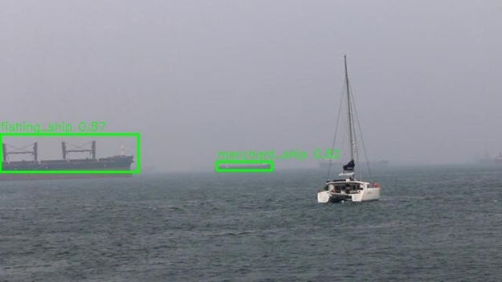</td>
    <td style="border: none;" width="33%">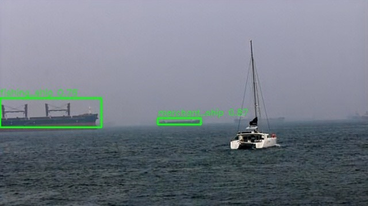</td>
    <td style="border: none;" width="33%">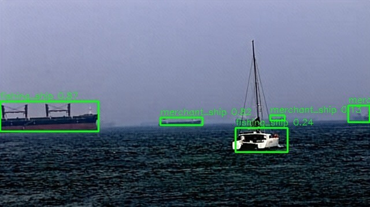</td>
  </tr>
  <tr style="border: none;">
    <td style="border: none;" align="center"><b>Original Image</b></td>
    <td style="border: none;" align="center"><b>OneRestore</b></td>
    <td style="border: none;" align="center"><b>OneRestore + KD</b></td>
  </tr>
</table>

## 🗓️ 프로젝트 진행 일정

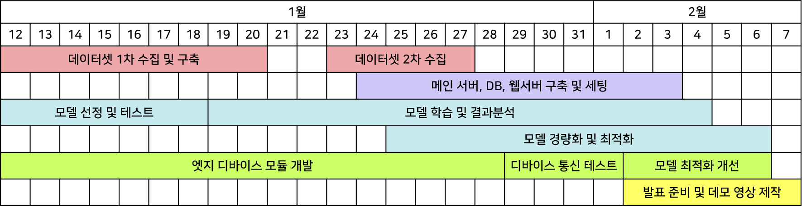

## 👥 Collaborators

<table>
  <thead>
    <tr>
      <th style="text-align: center;">팀원</th>
      <th style="text-align: center;">역할</th>
    </tr>
  </thead>
  <tbody>
    <tr>
      <td style="white-space: nowrap;" width="90px" align="center"><nobr><b>도담록</b></td>
      <td style="text-align: justify;">데이터 수집 및 EDA, 메인서버 구현, DB 구현, DB 및 Clova Studio 메인 서버 연동</td>
    </tr>
    <tr>
      <td style="white-space: nowrap;" width="90px" align="center"><b>정현우</b></td>
      <td style="text-align: justify;">프로젝트 운영 및 테스트 설계, 이미지 복원 모델 학습, 이미지 복원 모델 Jetson Orin Nano 최적화, CCTV 모듈 개발</td>
    </tr>
    <tr>
      <td style="white-space: nowrap;" width="90px" align="center"><b>조예원</b></td>
      <td style="text-align: justify;">데이터 수집 및 EDA, 가상 열화 데이터 생성, 웹 서버 구축 (프론트엔드 / 백엔드), 웹 서버와 DB 연동</td>
    </tr>
    <tr>
      <td style="white-space: nowrap;" width="90px" align="center"><b>최중식</b></td>
      <td style="text-align: justify;">이미지 복원 모델 학습, 이미지 복원 모델 경량화 및 테스트, 가상 열화 데이터 생성</td>
    </tr>
    <tr>
      <td style="white-space: nowrap;" width="90px" align="center"><b>최진우</b></td>
      <td style="text-align: justify;">객체 인식 모델 학습, 객체 인식 모델 추론 최적화, CCTV 모듈 개발</td>
    </tr>
  </tbody>
</table>

## 🛠️ Tech Stack

 

 
 

 
  
 
 
 
 
 

## 👨‍🔬 References

-  (주)미디어그룹사람과숲(AI Hub 공개), 눈, 비, 안개 등의 다양한 외부 환경 노이즈 제거를 위한 영상 데이터, 2021
-  (주)유에스티21(AI Hub 공개), 해무/안개 cctv데이터, 2021
-  (주)흥일기업(AI Hub 공개), 군 경계 작전 환경 내 인식 데이터, 2024
-  Singapore maritime Dataset, Prasad, Dilip K., et al. "Video processing from electro-optical sensors for object detection and tracking in a maritime environment: A survey." *IEEE Transactions on Intelligent Transportation Systems* 18.8 (2017): 1993-2016."
-  LMHaze Dataset, Zhang, Ruikun, et al. "Lmhaze: intensity-aware image dehazing with a large-scale multi-intensity real haze dataset." *Proceedings of the 6th ACM International
Conference on Multimedia in Asia*. 2024."
-  RESIDE6K, Liu, Bing, et al. "Residual-based Efficient Bidirectional Diffusion Model for Image Dehazing and Haze Generation." *2025 IEEE International Conference on Multimedia
and Expo (ICME)*. IEEE, 2025."
-  Guo, Yu, et al. "Onerestore: A universal restoration framework for composite degradation." *European conference on computer vision*. Cham: Springer Nature Switzerland, 2024."
-  Cui, Yuning, Wenqi Ren, and Alois Knoll. "Bio-Inspired Image Restoration." *The Thirty-ninth Annual Conference on Neural Information Processing Systems*. "
-  Sandler, Mark, et al. "Mobilenetv2: Inverted residuals and linear bottlenecks." Proceedings of the IEEE conference on computer vision and pattern recognition. 2018."
-  Redmon, Joseph, et al. "You only look once: Unified, real-time object detection." Proceedings of the IEEE conference on computer vision and pattern recognition. 2016."
-  Jocher, Glenn, et al. Ultralytics YOLO Version 8, Ultralytics, 2023, https://platform.ultralytics.com/ultralytics/yolov8
-  Zhang, Yifu, et al. "Bytetrack: Multi-object tracking by associating every detection box." *European conference on computer vision*. Cham: Springer Nature Switzerland, 2022."
-  Jacob, Benoit, et al. "Quantization and training of neural networks for efficient integer-arithmetic-only inference." Proceedings of the IEEE conference on computer vision and pattern recognition. 2018.

